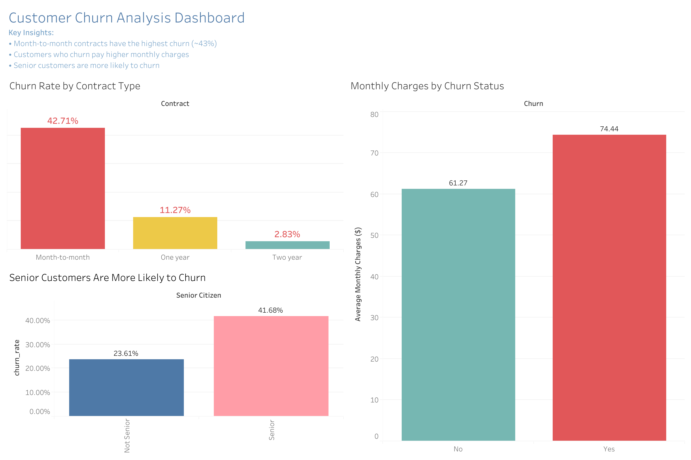

# 📊 Customer Churn Analysis

## 🔍 Project Overview

This project analyzes customer churn behavior using SQL and Tableau.  
The goal is to identify key factors that influence customer churn and provide actionable business insights.

---

## 📁 Dataset

- Source: Telco Customer Churn dataset (Kaggle)
- Records: ~7,000 customers
- Features include:
  - Contract type
  - Monthly charges
  - Customer demographics
  - Churn status

---

## 🛠 Tools Used

- SQL (PostgreSQL)
- Tableau (Dashboard & Visualization)
- DBeaver

---

## 📊 Dashboard Preview

View Interactive Dashboard on Tableau: https://public.tableau.com/views/Customerchurnanalysis_17770716825330/Dashboard1?:language=en-US&publish=yes&:sid=&:redirect=auth&:display_count=n&:origin=viz_share_link

---

## 💡 Key Insights

- 📌 Customers with **month-to-month contracts** have the highest churn (~43%)
- 💰 Customers who churn tend to have **higher monthly charges**
- 👵 **Senior customers** are significantly more likely to churn (~42%)

---

## 📈 Business Impact

These insights can help businesses:
- Improve retention strategies
- Offer better pricing plans
- Target high-risk customer segments

---

## 📌 Conclusion

The analysis shows that contract type is the strongest driver of churn, with month-to-month customers being significantly more likely to leave. 

Customers who churn tend to have higher monthly charges, suggesting potential pricing dissatisfaction. Additionally, senior customers are at a higher risk of churn compared to non-senior customers.

Overall, the results highlight key customer segments that require targeted retention strategies to reduce churn and improve long-term customer value.

---
